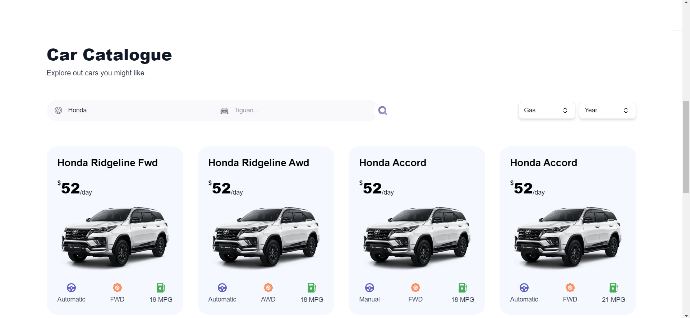
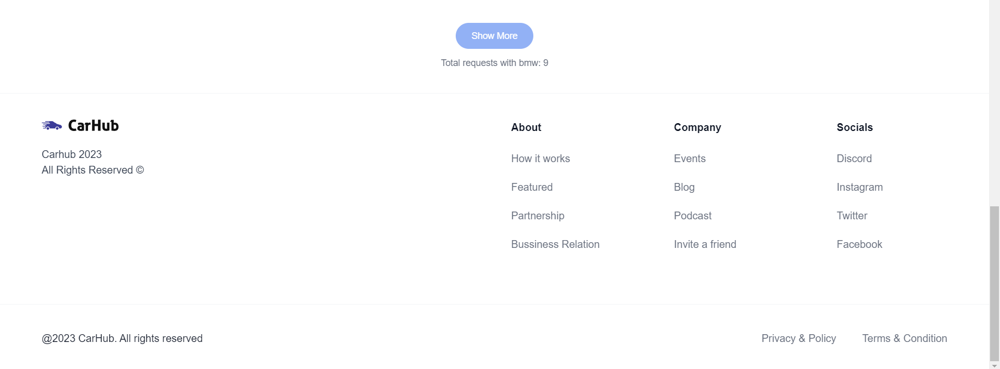

# Car Showcase App

This project is based on the **NextJs 14** crash course from JS Mastery.

In this branch you'll find:

-   **Typescript** language.
-   **App Router** navigation.
-   Server- and clientside rendering.

Changes:

-   Backend api was changed to the custom GraphQL api (repository **[backend api](https://github.com/cyrusrose/car_showcase_server)**).
-   GraphQL **Apollo Client**.
-   **Codegen** for schema generation.
-   **Prettier** plugin for one code theme.

## Screenshots

  
  
  

